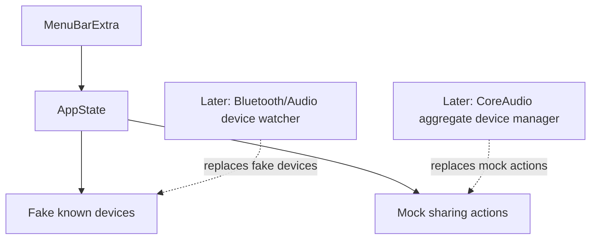

# SharePods Design

## Goal

Build SharePods, a native-feeling macOS menu bar app that helps a user share system audio across multiple Bluetooth/audio devices. The first implementation is a clickable SwiftUI shell with fake devices, focused on visual quality, app structure, and a beginner-friendly run/build loop.

## Decisions

- Product direction: Native Calm.
- First milestone: clickable shell with fake devices, not live CoreAudio.
- Bootstrap: Xcode macOS SwiftUI app project.
- Development loop: Xcode project plus terminal build/test commands.
- Device model: show all known audio devices, not only currently connected devices.
- Persistence later: use `UserDefaults` for known device identifiers; no database.
- Dependencies: none for the first pass.

## User Experience

SharePods lives in the macOS menu bar. It should not open a normal Dock window for the first pass. The menu bar extra opens a compact popover that uses system materials, SF Symbols, system colors, rounded cards, and short literal copy.

The app has four visible states:

1. Idle
   - Message: “Connect another audio device to share audio.”
   - Shows known devices.
   - Connected devices appear first.
   - Disconnected devices remain visible but dimmed.
   - Primary action is disabled until two devices are connected.

2. Ready
   - Message: “2 devices connected.”
   - Shows at least two connected devices at the top of the list.
   - Primary action: “Start Sharing.”
   - Optional toggle: “Auto-share next time.”

3. Sharing
   - Message: “Sharing audio.”
   - Sharing devices show an active status.
   - Primary action: “Stop Sharing.”
   - Volume rows may be shown as disabled/mock controls in the first pass.

4. Issue
   - Message: “One device disconnected.”
   - The disconnected device remains in the known device list with a disconnected status.
   - Primary action in the clickable shell: “Reset.”

## Device List

The main content section is titled “Devices.”

Each device card shows:

- Device name, such as “Winston’s AirPods Pro.”
- Status pill: Connected, Disconnected, or Sharing.
- Optional small metadata: battery percentage and later “last seen” text.
- Connected devices sorted above disconnected known devices.
- Dimmed styling for disconnected devices.

The first milestone uses fake known devices in memory so the UI can be exercised without Bluetooth or CoreAudio. The later functional pass should identify real devices by stable CoreAudio/Bluetooth identifiers and persist the known list in `UserDefaults`.

## Architecture

The first pass should keep the app small and replaceable:



Initial files:

- `SharePodsApp.swift`
  - SwiftUI app entrypoint.
  - Defines the menu bar extra.
  - Avoids a normal main window in the first pass.

- `SharePodsPopover.swift`
  - Contains the popover layout.
  - Renders idle, ready, sharing, and issue states.
  - Owns only presentation logic.

- `DeviceCard.swift`
  - Reusable device card view.
  - Displays name, status, battery/metadata, and active state.

- `SharePodsState.swift`
  - Observable state for the first pass.
  - Holds fake known devices.
  - Provides actions: `addSecondDevice()`, `startSharing()`, `stopSharing()`, `simulateDisconnect()`, and `reset()`.

- `MockDevice.swift`
  - Small value type for fake device display data.
  - Fields should cover name, connection status, battery, and whether the device is currently sharing.

Do not add protocols, plugin systems, or service layers until real Bluetooth/CoreAudio code needs a seam. The fake state methods are the seam for now.

## Development Workflow

Create a real Xcode macOS App project in `share-pods/`:

- Product name: `SharePods`.
- Interface: SwiftUI.
- Language: Swift.
- Minimum macOS: design for macOS 14 or newer.
- App style: menu bar utility via `MenuBarExtra`.

Run in Xcode:

1. Open `SharePods.xcodeproj`.
2. Select the `SharePods` scheme.
3. Press `Cmd+R`.
4. Click the menu bar icon to open the popover.

Build from terminal:

```bash
xcodebuild -project SharePods.xcodeproj -scheme SharePods -configuration Debug build
```

Test from terminal:

```bash
xcodebuild test -project SharePods.xcodeproj -scheme SharePods -destination 'platform=macOS'
```

Run the built app from terminal after a Debug build:

```bash
open build/Debug/SharePods.app
```

There is no Node-style dev server for native SwiftUI. Use Xcode Previews for fast individual view iteration and `Cmd+R` for real menu bar behavior. A helper script that wraps `xcodebuild && open` can be added later only if the raw commands become annoying.

## Mock Controls

The first pass includes small development controls in the popover footer so the UI can be exercised without hardware integration:

- Add second device.
- Start sharing.
- Simulate disconnect.
- Reset.

These controls are for the clickable shell only. They should be removed or hidden when real device detection and CoreAudio control are implemented.

## Testing

The first pass should include one focused model-level test for state transitions:

- Idle when fewer than two devices are connected.
- Ready when two devices are connected.
- Sharing after `startSharing()`.
- Issue after a sharing device disconnects.
- Reset returns to the initial fake state.

Manual smoke test:

1. Run the app in Xcode.
2. Open the menu bar popover.
3. Confirm known devices render with connected and disconnected statuses.
4. Use mock controls to reach idle, ready, sharing, and issue states.
5. Confirm the menu bar utility feels native and does not show a normal main window.

## Out of Scope for First Pass

- Real Bluetooth listeners.
- Real CoreAudio aggregate or multi-output device creation.
- System default output switching.
- Volume-key interception.
- App Store packaging.
- Custom branding beyond native typography, spacing, and system symbols.
